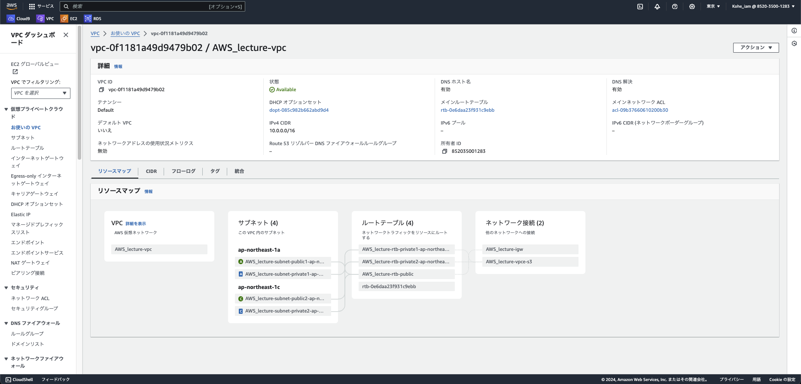
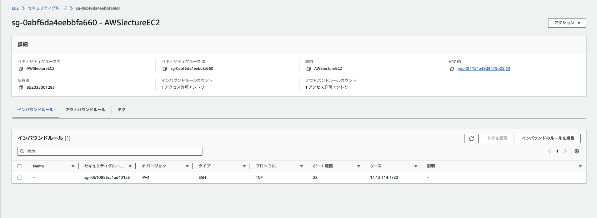
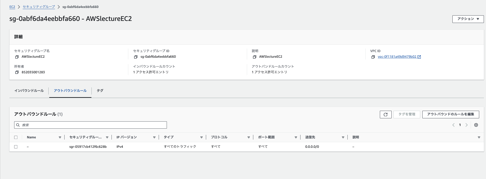
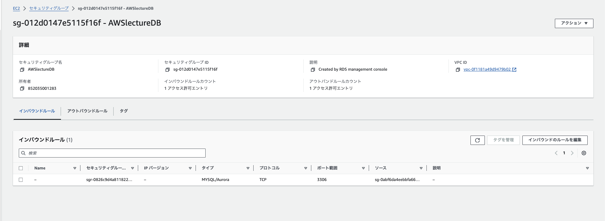
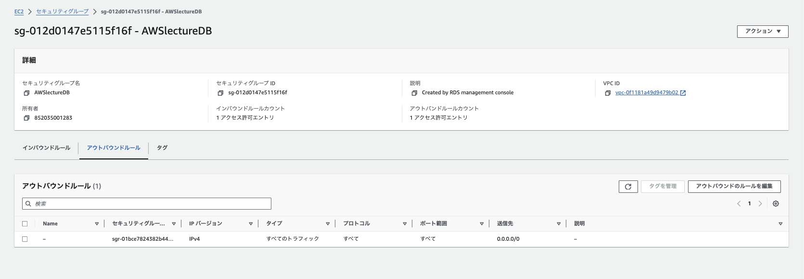
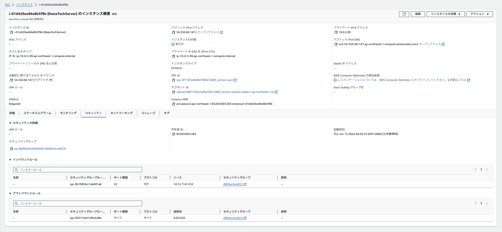
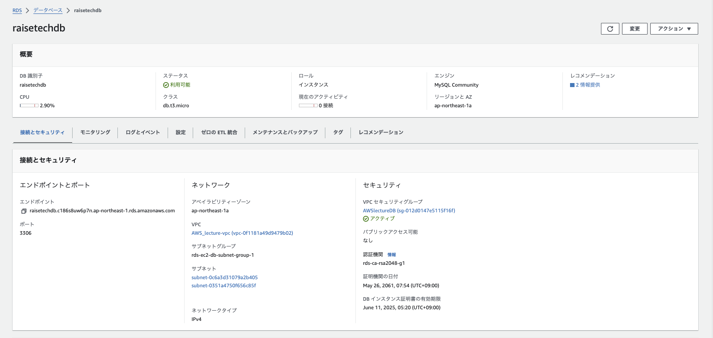
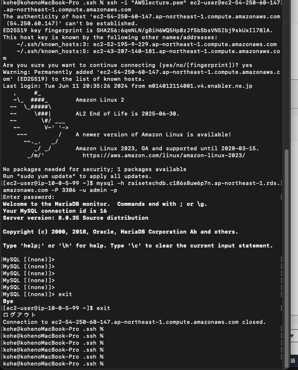

# 第４回課題報告
## 報告内容
    1.VPCの作成
    2.セキュリティーグループの作成
    3.EC2の作成
    4,RDSの作成
    5.EC2とRDSの接続確認

### 1.VPCの作成

---

### 2.セキュリティーグループの作成
EC2用にに設定したセキュリティグループ
- インバウンドルール  

- アウトバウンドルール  
  

RDS用に設定したセキュリティグループ
- インバウンドルール  
  
- アウトバウンドルール  
  
---

### 3.EC2の作成  

---

### 4.RDSの作成  

---

### 5.EC2とRDSの接続確認  

---

## 感想
VPCの作成は割とすぐにできましたが、EC2・RDSの作成には時間がかかりました。  
セキュリティーグループはどのように作成すれば良いのか。繋がらないEC2とRDS。  
などなど一つ問題を解決すると次の問題が発生し、なかなか前に進まない状況でした。  
メンターの方に質問しながら、なんとか前に進めている状況です。  
第4回課題の提出はなかなか成功体験が得られず、ゴリゴリと学習モチベーションを削られていきました。
