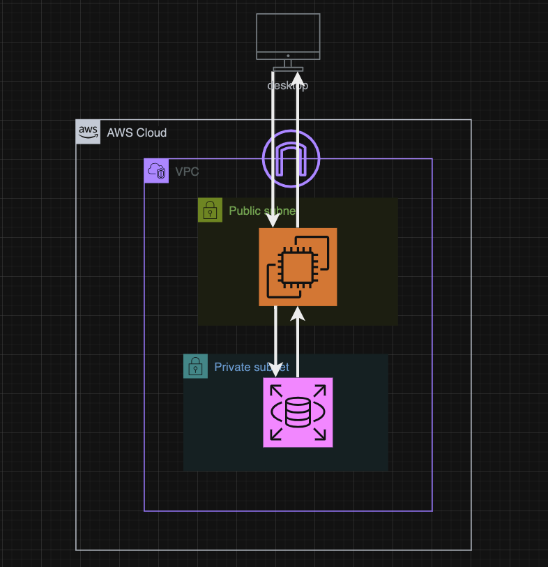

# 第４回課題報告
## 報告内容
    1.VPCの作成
    2.セキュリティーグループの作成
    3.EC2の作成
    4,RDSの作成
    5.EC2とRDSの接続確認
## 構成図

### 1.VPCの作成
  
---

### 2.セキュリティーグループの作成
EC2用にに設定したセキュリティグループ
- インバウンドルール  

- アウトバウンドルール  

RDS用に設定したセキュリティグループ
- インバウンドルール  

- アウトバウンドルール  

---

### 3.EC2の作成  

---

### 4.RDSの作成  

---

### 5.EC2とRDSの接続確認  

