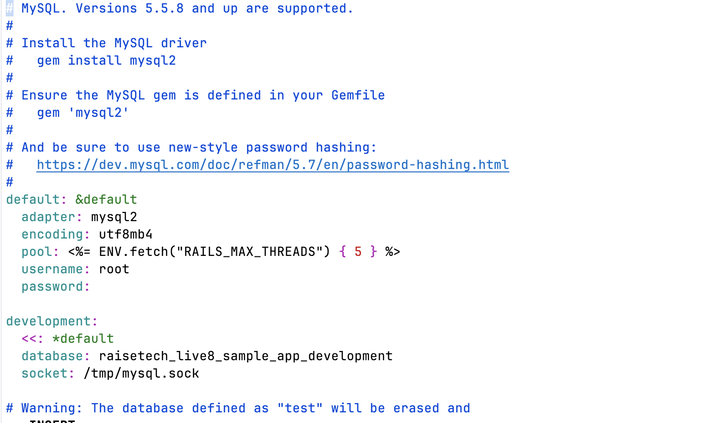
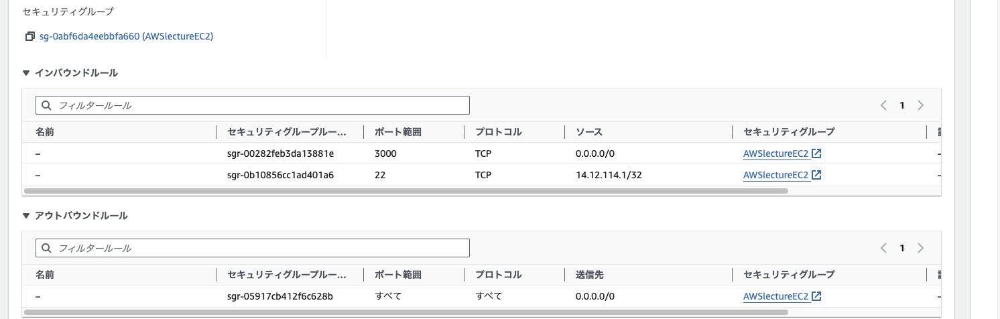
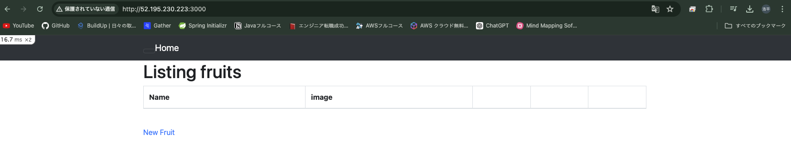
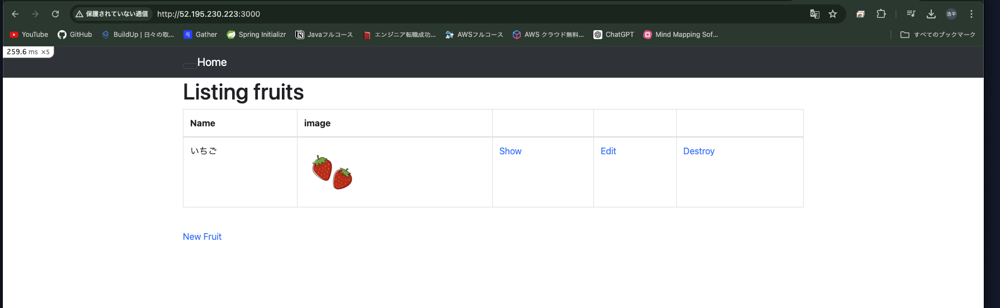
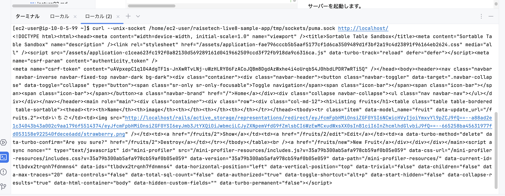
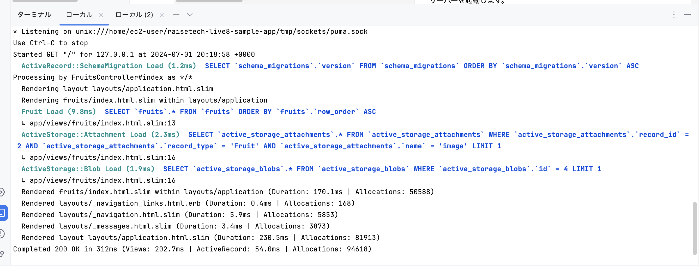
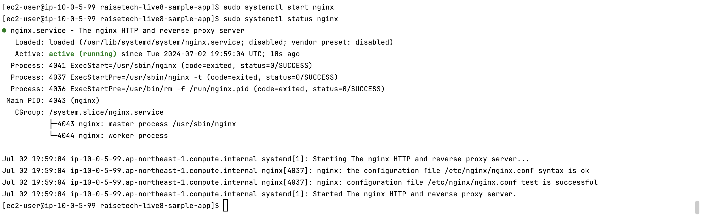
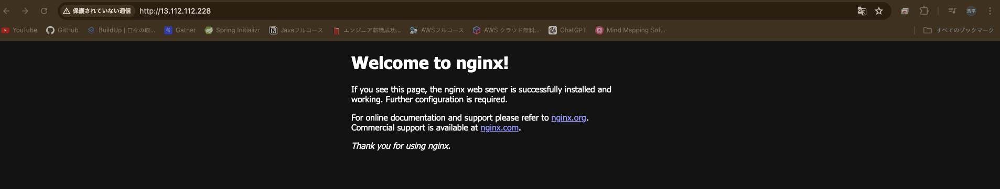

# 第５回課題の実装

---
#### 実装内容　第３回課題のサンプルアプリケーションを第４回課題で構築したVPC上にデプロイ

---

## 動作環境の構築
サンプルアプリケーションを動作させるための環境を確認します。  
[サンプルアプリケーションのリンク](https://github.com/yuta-ushijima/raisetech-live8-sample-app)

| パッケージ   | バージョン | 目的                                 |
|---------|-------|------------------------------------|
| Ruby    |3.2.3| アプリケーションを実行するため                    |
| Bundler |2.3.14| Rubyを起動させるために必要な依存環境を適切に管理してくれるツール |
| Rails   |7.1.3.2| Ruby用のWebアプリケーションフレームワーク           |
| Node    |v17.9.1| JavaScriptを実行するツール                 |
| yarn    |1.22.19| JavaScriptのパッケージ管理ツール              |
※令和６年６月時点のバージョンです

## 実装手順
### 組み込みサーバー「puma」のみでの起動
### 1. EC2に接続
```
ssh -i キーペア名.pem ec2-user@<パブリックIP>
```
### 2. EC2上にRuby on Rails環境を構築するための基本的なツールとライブラリをインストール
```
sudo yum -y update
```
```
sudo yum  -y install git make gcc-c++ patch libyaml-devel libffi-devel libicu-devel zlib-devel readline-devel libxml2-devel libxslt-devel ImageMagick ImageMagick-devel openssl-devel libcurl-devel curl
```
### 3.rbenvをインストール 
`rbenv`とは複数のバージョンのrubyをまとめて管理するツールです。
```
git clone https://github.com/sstephenson/rbenv.git ~/.rbenv
```
ターミナルでrbenvコマンドが実行できるようにパスを追加します
```
echo 'export PATH="$HOME/.rbenv/bin:$PATH"' >> ~/.bash_profile
```
シェルを起動するたびにrbenvが正しく初期化される設定を行います
```
echo 'eval "$(rbenv init -)"' >> ~/.bash_profile
```
.bashrcファイルを再読み込みさせ上記２つの設定を反映させます
```
source ~/.bash_profile
```
### 4.ruby-buildをインストール
`ruby-build`とはrbenvのプラグインの一つです。特定のバージョンのRubyをインストールすることができます。  
.bashrcファイルを再読み込みさせ上記２つの設定を反映させます
```
git clone https://github.com/rbenv/ruby-build.git ~/.rbenv/plugins/ruby-build
```
### 5.Rubyをインストール
ダウンロード可能なRubyのバージョンリストを表示させ,
3.2.3が含まれていることを確認します。
```
rbenv install --list-all
```
Ruby3.2.3をインストールします。結構時間がかかります。
```
rbenv install 3.2.3
```
デフォルトで使用すRubyが3.2.3になるよう設定します。
```
rbenv global 3.2.3
```
Rubyのバージョンを確認します
```
ruby -v
```
### 6.Bundlerをインストール
`Bundler`はRubyの依存関係を管理するツールです。  
Bundler2.3.14をインストールします。
```
gem install bundler -v '2.3.14'
```
インストールしたBundlerのバージョンを確認します。
```
gem list bundler
```
### 7.Railsをインストール
`Rails`とはRuby on Railsの略称でオープンソースのWebアプリケーションフレームワークです。  
Rails7.1.3.2をインストールします。
```
gem install rails -v 7.1.3.2
```
インストールしたRailsのバージョンを確認します。
```
rails -v
```
### 7.NVMをインストール
`NVM`とはNodeVersionManagerの略で複数のNodeのバージョンを簡単に管理することができます。 
NVMをインストールします。
```
curl -o- https://raw.githubusercontent.com/nvm-sh/nvm/v0.39.7/install.sh | bash
```
.bashrcファイルを再読み込みさせNVMのインストールを反映させます
```
source ~/.bashrc
```
インストールしたNVMのバージョンを確認します。
```
nvm -v
```
### 8.Nodeをインストール
'Node'とはJavaScriptを実行できるツールです。  
Node v17.9.1 をインストールします。
```
nvm install v17.9.1
```
インストールしたNodeのバージョンを確認します。
```
node -v
```
### 9.Yarnをインストール
'Yarn'とはJavaScriptのパッケージマネージャーで依存関係を適切に管理してくれます。  
npm(NodePackageManager)を使用してYarn1.22.19をインストールします。
```
npm install -global yarn@1.22.19
```
インストールしたYarnのバージョンを確認します。
```
yarn -v
```
### 10.MySQLをインストール
AmazonLinux2の場合を想定しています。  
yumを最新にアップデートします。
```
sudo yum update -y
```
デフォルトで作成されているMariaDB関連ファイルを削除します。  
この作業を行わないとMysqlにおいてうまく実行してくれないコマンドがあります。
```
sudo yum remove -y mariadb-*
```
MySQLのリポジトリをyumに追加します。
```
sudo yum localinstall -y https://dev.mysql.com/get/mysql80-community-release-el7-11.noarch.rpm
```
MySQLの起動に必要なパッケージをインストール
```
sudo yum install -y mysql-community-server
sudo yum install -y --enablerepo=mysql80-community mysql-community-devel
```
ログファイルの作成
```
sudo touch /var/log/mysqld.log
```
MySQLの起動
```
sudo systemctl start mysqld
```
ディレクトリの所有権と権限を修正
```
sudo chown -R mysql:mysql /var/lib/mysql
sudo chmod -R 750 /var/lib/mysql
sudo chown mysql:mysql /var/log/mysqld.log
sudo chmod 640 /var/log/mysqld.log
```
MySQLの再起動
```
sudo systemctl restart mysqld
```
MySQLのステータス確認
```
sudo systemctl status mysqld
```
初期パスワードの設定  
初期パスワードを確認します。
```
sudo systemctl status mysqld
```
実行すると下記ログが表示されますのでパスワードをコピーします。
```
/// 表示されるログです
A temporary password is generated for root@localhost: [パスワード]
```
MySQLにログイン
```
mysql -u root -p
//[パスワード]を入力しEnter
```
***エラーの解消***  
MySQLにログインしようとしても下記のようなエラーが発生しました
```
ERROR 2002 (HY000): Can't connect to local MySQL server through socket '/var/lib/mysql/mysql.sock' (13)
```
- エラーの内容  
MySQLクライアントが指定されたソケットファイル（/var/lib/mysql/mysql.sock）を介してMySQLサーバーに接続できなかったことを示しています。
- エラーの解消方法
ソケットファイルの作成
```
sudo touch /tmp/mysql.sock
```
を実行し、ソケットファイルを作成することでエラー解消できました。

### 11.サンプルアプリケーションをクローン
サンプルアプリケーションをEC2上にクローン
```
git clone https://github.com/yuta-ushijima/raisetech-live8-sample-app.git
```
### 12.組み込みサーバーでデプロイ
サンプルアプリケーションのconfigディレクトリへ移動
```
cd raisetech-live8-sample-app/config
```
database.yml.sampleをコピーしdatabase.ymlファイル作成
```
cp database.yml.sample database.yml
```
viコマンドを使用して接続先をRDSへ変更します。
```
vi database.yml
```
以下のようにターミナルで表示されます

insertモードに入ります。
```
iキーを押します。
viエディタの末尾に[-- INSERT --]と表示されます。
```
接続先をRDSに変更します。
```
<変更前>
〜
default: &default
  adapter: mysql2
  encoding: utf8mb4
  pool: <%= ENV.fetch("RAILS_MAX_THREADS") { 5 } %>
  username: root
  password:
〜
<変更後>
〜
default: &default
  adapter: mysql2
  encoding: utf8mb4
  pool: <%= ENV.fetch("RAILS_MAX_THREADS") { 5 } %>
  username: [RDSのユーザ名]
  password: [RDSのタパスワード]
  host    : [RDSのエンドポイント]
  port    : 3306
〜
```
編集を保存します。
```
Escキーを押してinsertモードを終了します。
viエディタの末尾に
:wq
と入力し、変更を保存します。こうすることで変更を保存してviエディタを終了させます。
```
EC2のセキュリティグループに'ポート番号 3000'を許可します。
3000番を許可することで、Ruby on RailsやNode.jsからのリクエストを受けるけます。

サンプルアプリケーションのルートディレクトリへ移動します。
```
cd raisetech-live8-sample-app
```
RubyonRailsを使用する環境構築を行うために下記コマンドを実行します。
```
bundle install
```
```
bin/setup
```
ブラウザにアクセスするためにwebpackをインストールします。
```
yarn add webpack webpack-cli
```
画像処理ライブラリであるmini_magickを追加します。
```
vim config/application.rb
```
insertモードに入ります。
```
iキーを押します。
viエディタの末尾に[-- INSERT --]と表示されます。
```
```
<変更前>
〜
class Application < Rails::Application
    # Initialize configuration defaults for originally generated Rails version.
    config.load_defaults 7.1
〜
<変更後>
〜
class Application < Rails::Application
    # Initialize configuration defaults for originally generated Rails version.
    config.load_defaults 7.1    
    config.active_storage.variant_processor = :mini_magick
〜
```
編集を保存します。
```
Escキーを押してinsertモードを終了します。
viエディタの末尾に
:wq
と入力し、変更を保存します。こうすることで変更を保存してviエディタを終了させます。
```
サーバーを起動します。
```
bin/dev
```
アプリケーションにアクセスします。
```
ブラウザでURLを入力しアクセス
http://[EC2のパブリックIP]:3000
```
このような画面が表示されれば成功です。

画像が正常に表示されるかも確認します。
いちごの画像を追加します。


### 組み込みサーバー「puma」及びUnixSocketを使用し動作確認 
***UnixSocket***とはコンピューターないで動作しているプログラム同士がデータをやり取りするための方法の一種です。  
今回の場合は、ネットワークとpumaを接続させるために使用します。
### 1.pumaサーバーの設定変更
pumaサーバーのリッスンの設定をデフォルトの3000からUnixSocketに変更します。
```
vim config/puma.rb
```
insertモードに入ります。
```
iキーを押します。
viエディタの末尾に[-- INSERT --]と表示されます。
```
```
<変更前>
〜
# Specifies the `port` that Puma will listen on to receive requests; default is 3000.
#
port ENV.fetch("PORT") { 3000 }
〜
<変更後>
〜
# Specifies the `port` that Puma will listen on to receive requests; default is 3000.
#
# port ENV.fetch("PORT") { 3000 }
〜
```
編集を保存します。
```
Escキーを押してinsertモードを終了します。
viエディタの末尾に
:wq
と入力し、変更を保存します。こうすることで変更を保存してviエディタを終了させます。
```
リッスンが変更されているか確認します。
```
rails s
```
```
以下のログが出れば成功です
〜
*  Min threads: 5
*  Max threads: 5
*  Environment: development
*          PID: ****
* Listening on unix:///home/ec2-user/raisetech-live8-sample-app/tmp/sockets/puma.sock
Use Ctrl-C to stop
```
## 2.接続確認
サーバーを起動します。
```
rails s
```
別タブを開き、EC２にアクセスします。  
その後、unixsocket通信を使用しアクセスします。
```
curl --unix-socket /home/ec2-user/raisetech-live8-sample-app/tmp/sockets/puma.sock http://localhost/
```
以下のようなログが表示されます。

htmlファイルが表示されているので成功です。

サーバーのログも確認しておきます。

Completed 200 OK が表示されているので成功です。

### Nginx単体での動作確認
***Nginx***とはインターネット上でWebページを表示させるためのWebサーバーの一種です。
### 1.Nginxをインストール
yumをアップデートします。
```
sudo yum update -y
```
Nginxをインストールします。
```
sudo amazon-linux-extras install nginx1 -y
```
Nginxバーションを確認し、正常にインストールできているか確認します。
```
nginx -v
```
## 2.接続確認
Nginxを起動させます。
```
sudo systemctl start nginx
```
Nginxのステータスを確認します。
```
sudo systemctl status nginx
```
以下のようなログが表示されていれば成功です。
```
// 表示されるログです
● nginx.service - The nginx HTTP and reverse proxy server
   Loaded: loaded (/usr/lib/systemd/system/nginx.service; disabled; vendor preset: disabled)
   Active: active (running) since Tue 2024-07-02 19:59:04 UTC; 10s ago
   ↑　active (running)になっているので起動しています
〜
```

続いてEC2のインバウンドルールを変更します。
```
EC2インバウンドルール
<変更前>
・22番ポート
・3000番ポート
<変更後>
・22番ポート
・80番ポート

3000番ポートはRubyonRailsなどのアプリケーションからのリクエストを受け付けるポートです。
80番ポートはHTTPリクエストを受け付けるポートです。
Nginxを通してWeb表示させるため、3000番ポートは不要になります。
```
Webページにアクセスします。
```
ブラウザでURLを入力しアクセス
http://[EC2のパブリックIP]
```
このように表示されれば成功です。
