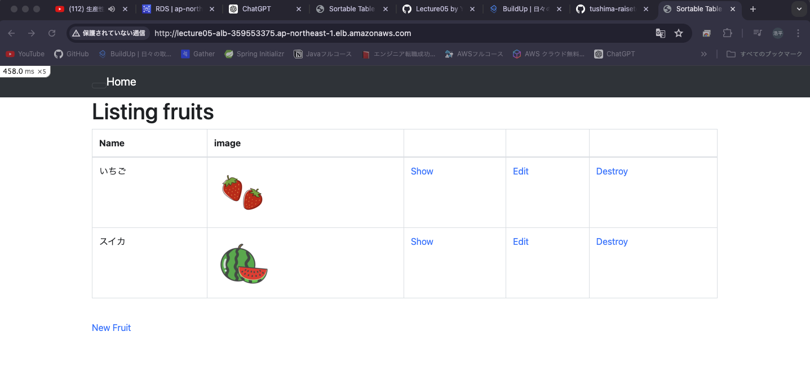
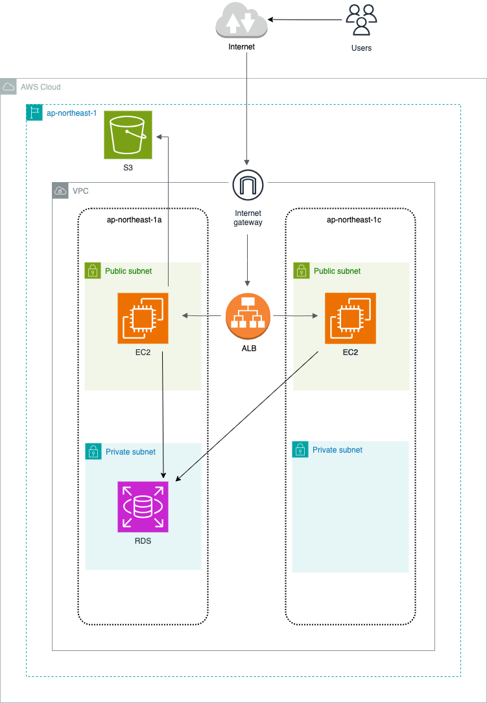

# 実装の報告
## 組み込みサーバーで起動

画像表示確認

## PumaサーバーとUnixSocketを使用して動作確認
curlコマンド

Serverログ

## Nginx単体での接続確認

## Nginx及びPumaを使用して接続確認

新規保存も問題なくできるか確認済み。

## ELB(ALB)を導入して接続確認

## S3を導入
アプリケーションで新しいフルーツを登録

アプリケーションに登録されているか確認

S3のオブジェクトURLにアクセス

## 構成図

## 感想
- アプリケーションをデプロイまで持って行けてよかった
- UnixSocket,Nginx,Pumaそれぞれの役割が手を動かしながらだとだいたい身につきました
- 課題完了まで長かったです
- セキュリティについては１箇所に設定しておけばOKなのではなく、使用するサービスごとにアクセス制限をかけることでセキュリティーを頑丈にするということがわかりました。